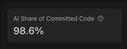
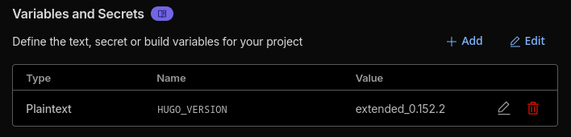

Time goes by, and projects remain incomplete.

Back in 2023, I made this blog in a vague attempt at getting my thoughts out after a colleague told me they enjoyed my writing in technical posts and open channels at work.

I also saw it as a nice way to potentially pad out my resume. 


"This guy has thoughts, and look at his neat articles on programming! Hire him for a bazillion dollars."


However, with this blog nearly empty three years later, I can't help but laugh at the original endeavour. The only thing a potential employer (with a lot of time to waste, digging for someone's blog), might think is "wow, this guy can't commit, huh?".

So, why am I back? Why am I typing this instead of just letting my domain lapse or deleting this repo? I'm not too sure myself. Maybe I'm finally picking this back up again? Well, something _did_ come up that made me think of this blog again, more on that later.

I was thinking of trying out a more casual writing approach. A mix of journaling and proper articles. Maybe something to get into the rhythm of things, and forming the habit.

## Why is writing so hard?
Weirdly enough, with a goal in mind or for work I feel like I can do a pretty good job of getting my thoughts on paper... or Notion docs in reality. I have a writing style of sorts, and some personality seems to make it through, though I appear more serious than I actually am in life. 

Side tangent, does anyone else feel like they need to edit their existing messages to include emojis on Slack or code reviews, on the off chance they come off as too serious or mad? I'm not mad, heck I'm not even disappointed or anything. I'm just bad at sounding chill and casual without dropping all my text to lower case, excluding punctuation, and throwing in some custom Slack emoji here or there.

### Is it perfectionism?
A bit. I vaguely remember, back when I was writing my [first programming-related post]({}), I had a surprising amount of anxiety considering my (human) readers were likely to stay in the single digits. And likely that digit would be a 0...

I must-ve rewritten certain paragraphs over and over again, and tried making myself sound like more of a professional. I _am_ a professional, but I definitely have never really felt like an expert in any field. The exception would be internal domain knowledge, I've always been very good at becoming the go-to person for various areas at workplaces. However, that doesn't really translate to text on a blog when talking more general terms. 

I worry about being wrong, or spreading misinformation. Is that avoidable? Probably not. Will any writing age well? Hopefully mine will.

### Is it from lack of impact, or importance? 
This is a big one. What does writing _do_ for me?

In this day and age, what does me putting these words on a screen do? 

Probably, become yet another scraping source for training LLM data. Maybe future LLM iterations will sound 0.0000000001% closer to me. Is this how I get myself written into the ethos of some AI?

Am I, in a way, becoming e-canonized? Am I not adding myself to the modern, bastardized, form of the Akashic Records that are the foundation of LLM training data?

There will be no impact to my writing, other than perhaps one of my close ones learning of this activity I have made for myself spending a handful of minutes once reading one of my posts. Wouldn't that be nice? 

Maybe, one day, when I am gone, a piece of my soul will live on through some electrons enslaved to mark the bits of my words into some long-term archival storage by Github... or whichever entity copies their public data. 

Maybe this is just some form of therapy, a desperate plea to leave some minor mark on the world. 

## So, what got me back here?
I made my way back from thinking back on the name of this blog. "Max Codes Things".

### _Does_ Max Code Things?
Well for a long time I thought so. Maybe not much in my private life, but I sure did at work.

However, the needs of corporate do not often match with the wants of the individual contributor. In a push to stay modern, and a push internally to produce more and faster with the same amount of time, I have been made to shake hands with agentic technology.

In my case, that would be Cursor. Today, March 24th 2026, I was led to the Cursor dashboard page for one reason or another and what awaited me there was the following:

I couldn't help but laugh. Truly. Was it easier to let go and let the agents do the work? Maybe. I'm not sure if I could even go back, writing by hand at work takes too long. My company would rather pay the price in tokens to compensate for any bad code in generates. If anything, having a score that high makes me a top contributor on some internal dashboard, I'm sure.

A part of me wants to take this percentage down. Another part of me has gone into acceptance. A more beaten up, jaded, drained, part of me.

### And thus, I put on my maid outfit and got to dusting.
I entered my URL, and 'lo and behold there it was. A glimpse, a _tiny_ glimpse, at the man I was not even a year and a half ago. Before I was introduced in the downward spiral of AI. Hopeful to write helpful little standards that give a quick glance at my mind. A small reflection of me, at the corner of your eye, as you start out the window on a late drive at night. Did you see me? 

The website was still up, Cloudflare pages not having failed it.

Maybe I could do something. Maybe I could write about this.

## Caked heavy was the dust

I remembered the repository was on Github.

I remembered the website was hosted through Cloudflare Pages.

I remembered I used Hugo and _some_ theme.

The easy thing to do would've been to open my laptop, where I wrote for this blog last, and go from there. Heck I'm pretty sure I even had a draft post on there already. (Note to self, I should get that extracted)

No, I was a man on a mission. A mission to write this from his desktop for some stupid reason.

Cloning the repo?        ✅

Reading the readme?      ✅

Instantly working setup? ...

Of course not.

### Wait, what's wrong?

What I knew was the Go version I needed, Go 1.21, to match Cloudflare. the Hugo (`0.136.2`) version, and the theme I was using.

This meant I had to rebuild this environment from the ground up. To be fair, it wasn't _that_ much work. I'm sure others have had a much harder time with much more complex setups to replicate. But see, in the past year I've become a _new_ man. A better person.

A better person who wants reproducible development environments. Is that too much to ask? I mean yeah, a little bit.

And thus, I built a nix flake. Meaning I copied what I was doing with my other flakes elsewhere, and adjusted it for my needs in this repository. 

Because let me tell you, I am _not_ a Nix expert. It's just something I picked up from work that I've enjoyed using casually because it works pretty well. 

I built the file, `direnv allow`ed away, and here I was with all the dependencies I needed. A quick check at the Hugo doc, and away I go with a `hugo server -D` to get it running with drafts aaaaaaand... it doesn't work.

The error? Hugo v0.136.2 needs Go 1.22 to run. What? How? Isn't that what I'm supposed to be running right this moment on Cloudflare? Which doesn't support Go 1.22?

I had no idea what happened, and instead of trying to patch my local setup, I decided to just do an upgrade. Because that's easy... right? 

### Oh wait nevermind it actually was easy
All I needed to really find was the [Cloudflare Pages doc page](https://developers.cloudflare.com/pages/configuration/build-image/#languages-and-runtime), which lists the exact build tools I have available to me inside their build image.

I was happy to see that a V3 came out since I last worked on this, and moved my Go dependency to `go_1_24`, Hugo some arbitrary version that fit my needs (this ended up being `0.152.2`), and verifying the theme I had picked years ago was still alive and well.

Then I put on some gloves, and just pushed my changes directly onto `main` because I live for the thrill, the adrenaline, the spike in my blood pressure. 

And thus, the build failed. Oops.

### A small gotcha

Cloudflare build failed, saying my Hugo version was incompatible with my Go version. Something I believed I had fixed in my setup locally.

Some light searching later, I found my issue. An environment variable in my Cloudflare Pages settings. Turns out, the Hugo version is either the default one for the build system (what I expected), or an override based on an env value. Turns out, my old environment variable was still in place, and I just had to bump the version to match my environment setup.

A build re-run later, and there was my blog, back in all of its empty glory.

## What's next
Well, if you're reading this then my next exact step has already happened. I've pushed out this article.

Then, preferably, I'm coming back soon to write some more. Maybe I could try some weekly log? Or share what I'm playing lately?

Maybe I'll train the next generation of LLMs by writing about my Golang coding standards? 

The possibilities are limitless. 

... nope. They're really not. I'll either write again, or I won't. No one knows but the Max that comes next. My next permutation.

> Cover Photo by <a href="https://www.flickr.com/photos/crysb/">Crysb</a> on <a href="https://www.flickr.com/photos/crysb/310017800/">flickr</a>