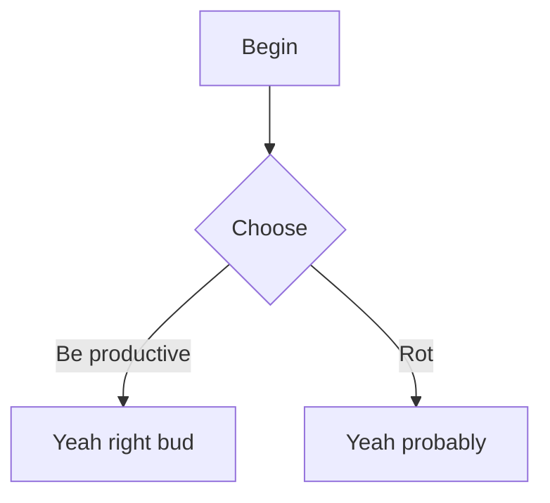

Hopefully having all of this together as a single page will make my life easier!

# Basic Markdown

## Headings
### go from one pound
#### down all the way
##### to a teeny tiny
###### six pound signs!

## Blockquotes

> Single level blockquote!


## Lists

Unordered
- Pen
- Pineapple
- Apple
- Pen pineapple apple pen

Ordered
1. Use `1.` ordering for all the numbers
1. So that moving lines around 
1. or adding items in the middle later
1. Still keeps the counting consistent

## Code

`Inline code`

```markdown
# Code blocks

With integrated
 - Code highlighting
```

The theme I used uses prismjs, [here is the list of supported languages](https://prismjs.com/#supported-languages)

## Strikethrough and Highlights

~~sliced~~

**Bold new lip**

*Arrivederci* (I did not look up the spelling. I will not verify. You may give me crap for this.)

***~~with their powers combined~~***

## Images and links


[Link!](https://en.wikipedia.org/wiki/Link_(The_Legend_of_Zelda))

[Link! With a Title! (hover)](https://en.wikipedia.org/wiki/Navi_(The_Legend_of_Zelda) "Listen!")

## Horizontal rule

---

***

___

## Task lists

- [x] Side quests
- [ ] Actual important task

## Callouts

> [!NOTE]
> Please make a note of this note.

> [!TIP]
> Tip! You can use pen and paper to take notes.

> [!INFO]
> Be informed that you do not actually need to take notes.

> [!WARNING]
> Be warned, I will know if you did.

> [!IMPORTANT]
> This doesn't matter. Typing this doesn't matter.

> [!CAUTION]
> You're threading dangerous territory.

# Hugo Extended markdown features

```go
// syntax highlighting
func main() {
    fmt.Println("oh wow such syntax")
}
```

```go {hl_lines=2}
// you can highlight lines???
func main() {
    fmt.Println("neat.")
}
```

[for lookup later](https://gohugo.io/render-hooks/code-blocks/)

## Fancy tables with aligns
| left-align | center-align | right align |
| :--------- | :----------: | ----------: |
| Left value | center value | right value |

# Hugo-Theme-Stack features

## Mermaid diagrams
