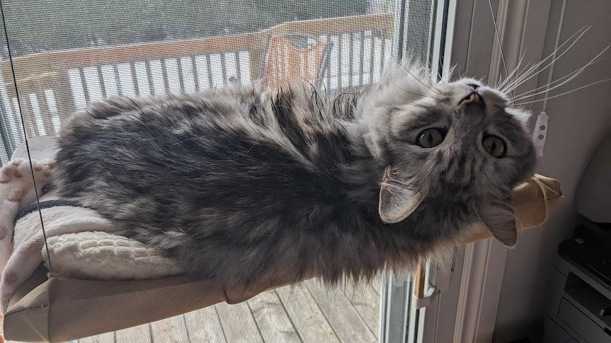

Following the excitement in my last post about being happy I had written within a week of the post prior to that one, I failed to write within a week again.

I am unsure as to how the average blog writer find the ideas and energy to type so often. The repeated exercise helps I supposed? The forming of habits?

I've decided to go for a bit more of a journal-type post today, a series of disconnected happenings.

## Getting good at Markdown

One thing I found myself doing often while writing the past few posts is struggling to find appropriate documentation about how to do some of the fancier markdown available to me from either Hugo by default or the theme I am using. 

So today, I wrote up a cheat sheet, which I've put up as [a de-listed article right over here](/p/cheat-sheet/). My first secret not so secret post! 

## Rustlings update!

Still going, but reaching the end soon. Looks like I'm 91/94, I could probably knock them out tonight if I truly wanted (I don't).

I'll make a post about it after closing out the few last ones, though it may be slightly underwhelming. 

## Pleasant weather

Today, we had very pleasant weather. Bright and sunny, going up to the mid tens (celsius) and plenty of wind. 

As I would jokingly tell my partner, a perfect day to be taken by the consumption. 

There's something incredibly relaxing about sitting in bed with the windows open and plenty of wind coming through. 

My calling this situation "the consumption" came from passing by the bedroom one day only to find my partner sitting up in her bed, a book down in front of her, looking longingly in the distance through the window -- reminding me of a victorian era patient stuck inside hoping to one day bask in the sun again.

It's a bit grim as a name, but I yearn for the feeling of comfort finding yourself in that bed position brings. I can only seem to get it on a sunny, windy afternoon in spring or autumn.

### Consumption
The name for it always makes me laugh, as I draw parallels to the joking deep voice a friend of mine gives to my pets.

A common sentence, when one of our cats comes to complain at us at lunch time is: 
> "f a t h e r, I must c o n s u m e."

However, the consumption itself was quite devastating, and one of the greatest leading causes of death in the 19th century. Nowadays, we know the consumption as tuberculosis. 

I recommend [this article by Imogen Clarke for the UK Science Museum](https://blog.sciencemuseum.org.uk/tuberculosis-a-fashionable-disease/), which talks about tuberculosis and the bizarre obsession with "consumption aesthetics".

## Minecraft!
I've been playing Minecraft since the Alpha days, even before the Nether was a thing. I was terribly young, and had no money to afford the game back then. I invite you to fill in the blanks.

I, like many, still get the cravings to play some Minecraft. I find the mindless digging to be quite relaxing an great time to listen to music albums I haven't gotten around to or various podcasts. 

However, having played the same game for so long, I grow tired of the usual loop quicker than I used to. This hasn't been so bad for the rest of my backlog, as that means I get back to playing other games I paid for.

But then, one day, during my my rotting times on Instagram, I was presented by a reel of someone reviewing a modpack for the game.

Modding back when I tried doing it involved a complicated system of managing jar files to place them in the right place in my `%APPDATA%` folder, only to break the game every other mod. This was a necessary evil for the time, as Optifine[^1] was the only reason the game even ran half-decently on my laptop at the time.

Nowadays though, the process is incredibly smooth. I've been using the [Prism Launcher](prismlauncher.org), which is an open-source launcher that allows for the easy setup of multiple Minecraft instances, including the download of full modpacks + automated setup from a variety of sources.

[^1]: Optifine was the de-facto Minecraft optimization mod back in the day. Surprisingly enough, the [Minecraft forum](https://www.minecraftforum.net/forums/mapping-and-modding-java-edition/minecraft-mods/1272953-optifine-hd-fps-boost-dynamic-lights-shaders-and) post still exists for it.

The only feature it lacked was the ability to download an setup FTB modpacks[^2], which are some of the most well known Minecraft modpacks out there. However, they've since released version 11.0.0 which brings (back[^3]) that ability. This is a fresh release from within 24 hours, at the time of writing this. 

[^2]: "Feed the beast" mod packs have existed for quite a long time, [here](https://www.feed-the-beast.com/) is their website.

[^3]: [Github issue](https://github.com/PrismLauncher/PrismLauncher/pull/3559). For a time, FTB forced other launchers to remove their packs, in an attempt to drive more traffic to their own packs. Their modpacks were removed from PrismLauncher in version 7.0.0. Looks like they've walked back that decision and have since allowed other launchers to put their packs back in.

With this, I've done very brief research and downloaded some random modpacks from the CurseForge provider. I am currently playing [Over Stars](https://www.curseforge.com/minecraft/modpacks/over-stars), which calls itself a "challenging Technology-RPG modpack". The reason I picked it is due to it's extensive number of custom quests, which are letting me learn about various mods a little bit at a time. I'm currently in the "Steampunk Age", learning how to use the popular [Create](https://www.curseforge.com/minecraft/mc-mods/create) mod to craft automation machines using gears powered by a water wheel to enable more complex crafting methods like crafting metal sheets using some kind of powered auto hammer?

This pack goes as far as the space age, involving going to other planets and setting up orbital stations. At that point, I don't know if it'll even still feel like Minecraft.

These modpacks contain hundreds of mods on average, each with their own little flavours and mechanics. There are some larger mods with _tons_ of mechanics that take a while to learn, and finding a mod pack with plenty of quests is a good way of getting your toes wet.

## Closing thoughts

This was an interesting writing experiment. I didn't know I would write about these things until I started writing.

This might've been better as a handful of blog posts instead of one with so many subjects, but this is how it came out this time.

I'm thinking of maybe taking some notes throughout the day when (and if) I think of subjects of things to talk about.