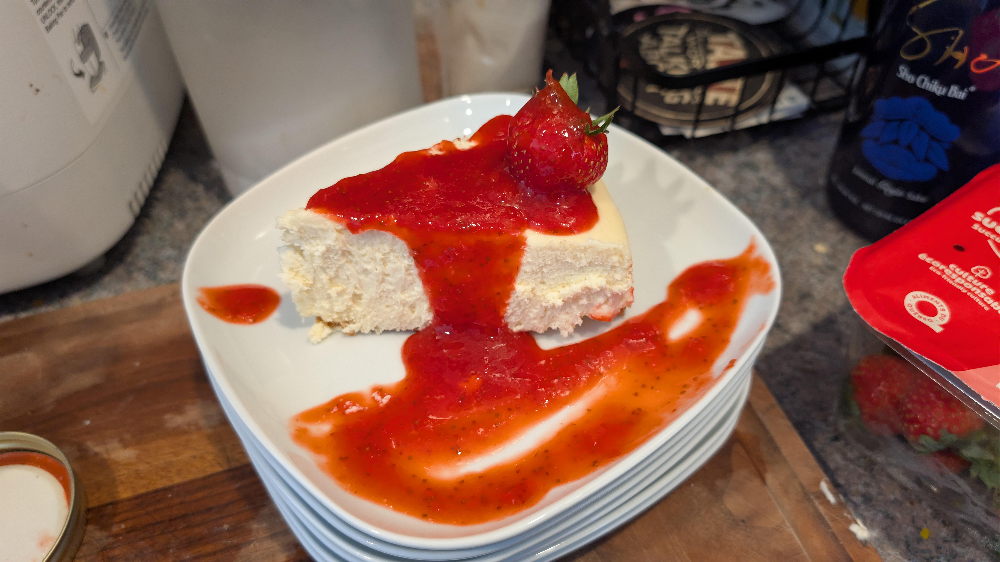
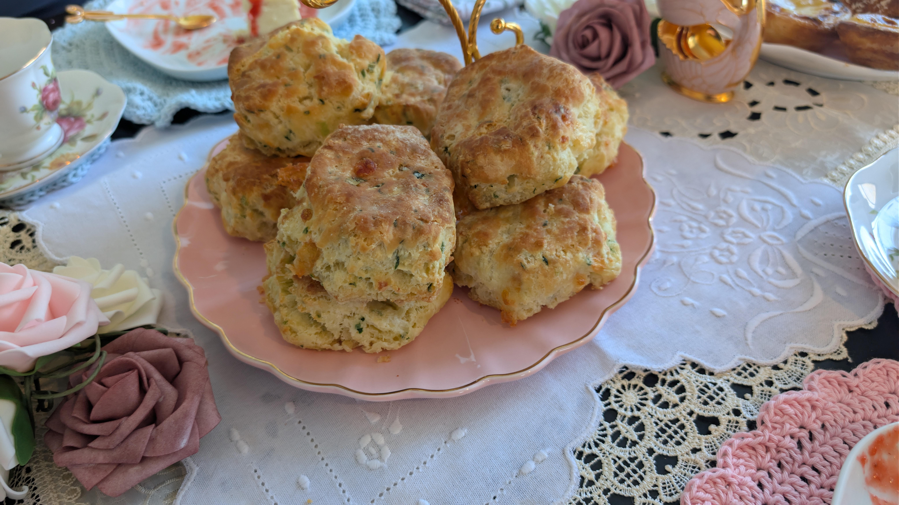

Today is June 1st. It's been a bit more than a month since I sat down to write.

In fact, I forgot to publish my last post entirely after writing it. It was fine, as it was quite short.

## Birthdays

I've been quite busy in the past month. May is the month of birthdays, and the last month of nigh-nonstop celebrating from Christmas-forward.

The highlight of which, as it is every year but especially this one, was my partner's birthday! She turned 30 this year, and I went extra hard on one of our yearly traditions.

Every other year, we host a small tea party for some of our close friends for her birthday. Another of our friends was born on the same day, so it also counts as two birthdays in one!

My trick for hosting is to generally just have way too much food, and some takeout boxes for people to bring some of the party back home.

There're a few places I know where to buy small treats, and then I try to make a handful of recipes myself.

The plan is simple: feed them lunch, a snack, and supper all in one. And then, when they think it's over and they're safe I ship them off with even more food to remember us by. 

I pour some of myself in the work, and it's part of how I show my love and appreciation to those close to me. I'm not great at voicing this love as often as I should, so I try to make up for it in my hosting.

This was the first set of birthdays, but we also saw the same group later that month for two additional birthdays. Overall, a very enjoyable time with some very fun and kind people.

## At Work

A bit messy, but what's new? 

The main highlight has been that I worked to fill out my promo packet. Should I have been the one to do so? Probably not, but I'm in an interesting position right now where my direct manager is the senior director of our department with ~70 people under her. Even more interesting is that she's now the interim VP with >200 people under her banner. She initially filled it out, but she was missing a lot of data as she just started a few months ago so it wasn't as strong as it could be. Instead, I worked on a V2 and she's going over the results this week to present later this month.

We'll see where that goes. If it doesn't go through, then it's probably time to look elsewhere, which is not something I want to do. I like my colleagues, the pay is above average and the benefits are good. However, friends, family _and_ colleagues are telling me that if it doesn't go through for some reason then it's time to go. The promotion I've been working to get for two years is the level at which my colleagues have argued I should've been hired at. 

Back when I applied to this job, my last company had already been through multiple rounds of layoffs and I was getting worried about the future. I had been put up for promotion, but all promotions were pushed back by 6-12 months, so I started looking. I was more worried about landing a job, so instead of going for a diagonal move I went for a position at the same level I was at. Now after 3 managers, and just as many reorgs, I finally feel like someone has my back to argue for my promotion. I just hope it finally happens, I've been working at that level for years now so I just feel like my career has been falling behind numbers wise.

Fun thing that's coming up, I'll be doing some presentations internally for teaching our new colleagues! Just some domain knowledge stuff, I'll prep some slides and whiteboard drawings. It'll make for a nice change of pace. We've had 5 new hires in my team of 13 devs the past two months alone. While AI has been an accelerator for the folks that have recently started as far as getting their boots on the ground and getting smalls tasks done, we've noticed that their domain knowledge is just not at the level we expect.

We recently threw one of the new hires into our support rotation as they were reaching 90 days, and they were struggling to answer even the more basic questions asked by our other internal teams, often relying on AI which led to hallucinations. The problems in that channel often involve things like finding production data in a weird state and needing to figure out how that state was reached. Often, these issues touch multiple services under our umbrella. These aren't things you can troubleshoot without at least some knowledge of the domain, AI can't fill in the blanks if you're unable to provide the right context.

## In life

Slow, so very slow. So very tired.

My partner and I just started semaglutide medication for weight loss, now that generics are available in Canada. We're hoping it helps us on the path back to health.

With better health, moving might become easier and energy would come faster after that. At least that's the hope.

Other than that, I've had no time for learning at home. Or in all honesty, it'd be better to say I've _made_ no time. Too much of my time has been spent rotting away last month, I've had to bring back app timers.

## June
This June, we need to rebuild the deck in the yard. We've never done anything like this so this should be... interesting? 

We're taking 10 days off for it, which will hopefully be enough. It'll make for a nice mental break though, which I feel I am in dire need of.

The weather is getting warm, the sun is out longer, my mood is a little better. Here's to summertime?

Photo by <a href="https://unsplash.com/@nelly13?utm_source=unsplash&utm_medium=referral&utm_content=creditCopyText">Nelly Antoniadou</a> on <a href="https://unsplash.com/photos/black-and-white-letters-letter-letter-y-6GbT1Q_-Hl4?utm_source=unsplash&utm_medium=referral&utm_content=creditCopyText">Unsplash</a>
      