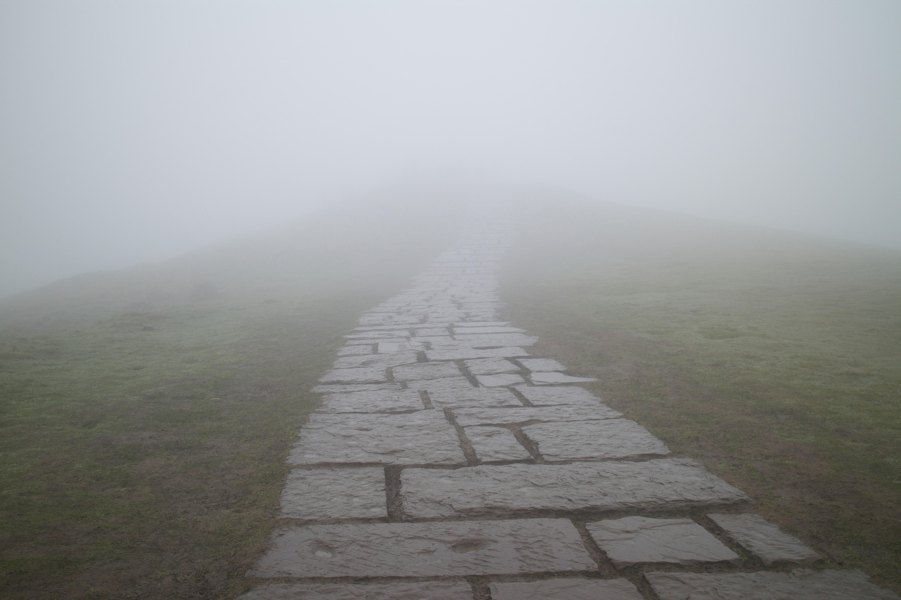

## The Context

I am driven by the wish to learn, but am dragged down by my own inability to focus after my hours of work are done.

I believe in giving it my all (and like to think I do), so I tend to be a husk drained of mental capacity after my work for the day is done.

I also find that my capacity to retain is much lowered when working or studying from home. 

This is something I wish to solve, for I fear I find myself facing the vilest beast of all to those who seek to improve: stagnation.

This would not be a blog post of the current era if I didn't mention AI, of course.

I used to pride myself on a few particular skills under my belt:
 * My ability to keep wider context in mind during implementation.
 * A deeper knowledge of the tools I use through specialization. Be it a programming language, framework or good ol' SQL.
 * Spinning anything into a learning opportunity for my peers. I learn understand deeper by teaching.

 Wider context and impact arching across projects and having a long-term vision I find to still be beneficial and a demarking feature, so that ones not doing too bad.

 The second, it could be argued, is still useful even in the context of agentic AI workloads. You need to have an idea of how something _should_ be implemented to infer if an implementation was done properly. Sadly, you can get 95% of the way there by just having an idea and then telling the AI: 
 
 > "You are a golang professional, make this golang better. No... the best! Make no mistakes, I hold your family hostage"

And as for my third point, even where I try to find points to share, my previously at least half-interested audience is nowhere to be found. I find my colleagues to be more disconnected than ever, reaching a new all time high checked-out wise.

## So?

I feel like I am stagnating. I am one of the more proficient user of these new tools of work on my team, but knowing how to better write a skill and how to leverage subagents is not giving me the depth and breadth of knowledge that gave me the satisfaction I needed in my day to day.

The drain I feel at the end of my day is no longer from a feeling of satisfaction at having done my work to the best of my abilities, but instead a fatigue of having pushed to be faster than ever at spending tokens in an attempt to get tasks done quicker. 

This could still be denial, but I do not want to end up falling into the persona of an "AI bro" in an attempt to make myself are relevant as humanly possible for the needs of my company. I have my gripes against the impact of that tech, how unsupervised and wild it is, and I do not wish to sell it to more and propagate it further.

Is there a cure?

## When did I learn? How did I learn?

I sometimes find myself missing school. Or at least, one specific part of it: being given an environment in which I could learn things I want to learn. 

In Cegep[^cegep], I was finally given the opportunity to choose a subject of study. As you'd guess from the subjects in this blog, I picked Computer Science. But not only that, I got to pick classes within these subjects! I got to pick Humanities, and even specific English subjects. Never before had learning been so easy and fun. It was still imperfect, of course. The goal was always graduation, and to attain that goal one had to have good grades. Learning was input to output grades, to satisfy some metrics to receive a certificate. It does not diminish the joy I felt and the awe I had for my teachers, but find the note to be important nonetheless. 

[^cegep]: A school level that sits between High School and University we have in Québec. Read more on [Wikipedia](https://en.wikipedia.org/wiki/CEGEP).

At work, I originally learned by doing. By taking inspiration from other's code, by reading blogs at adequate times, digging through endless (and often insufficient) documentation page. [Laravel's docs](https://laravel.com/docs/) was the first large piece of documentation I read, as it was the framework I worked with. I worked hard to keep myself up to date and kept learning about features as they came out. I refactored features, applied new patterns, led learning presentations, enforced better patterns in code reviews... etc. And I found myself placed on a pedestal by my team, hailed as some kind of prodigy and young expert on the subjects. I really was not though, all I had done is read documentation and thought about where to apply the learning. I took notes.

This is something anyone could do. Could've done. Why hadn't they?

This continued when I started helping out more and more with SQL queries and working on CRON jobs. It led me to become a Data Architect, a very fancy role title that simply meant I did every little thing data oriented: from engineering to administration to optimization. 

I continued in my next role: Golang + GCP.

In my current role, more Golang, some AWS, some Stripe...

But never at home. 

And now, with this renewed will, and this missing hole in the heart of my brain, I ask myself: why not? 

## A will, however faint. A way, perhaps?

The best approach is still unknown to me, but I will try to find something that works.

I think I can figure something out with this blog. Some kind of learning log, maybe? 

A way to break from the grind and rethink about what I've learned?

I tried reading full books in the past, some of those O'Reilly bricks. They're full of tasty tasty knowledge that make me salivate, but my goodness is my attention low for the technical parts. I need to find a way that works after work in small iterations.

I know that if I try to dedicate a 2-3 hour block I'll fail, because I did try before now and that happened.

I also need to find ways to _remember_ what I've learned. Notes would be a good place to start, and small retrospectives could be beneficial too.

## The roughest of plans, a 50-grit plan.
Haha! Sandpaper joke. (?)

Okay. Let's ignore whatever that was.

I want to learn technical things again. I want to get better in my core skillsets. I need guidance though. At work, it was easy to know what to learn next: it's whatever I needed to know about for my next project, or knowledge others didn't have, or something that could benefit long term.

Now though, seeing as it's maybe a bit more for myself, I need to draft out some kind of path. At least for now, while I get more used to things again.

There's a website I found, probably more than 5 years ago now, [Roadmap.sh](https://roadmap.sh/). Their whole concept was building out a learning roadmap and linking resources for each node. I could start from one of those paths and go forward.

As of right now, there're three things I wanted to work on:

1. Just more [Golang](https://roadmap.sh/golang). That one still has some use at work, and I still have weaknesses in areas that I don't touch often. This could be a good review of my knowledge and way to fill in the gaps.

2. [Rust](https://roadmap.sh/rust). I've always wanted to learn a lower level language but never wanted to get into C/C++. This is a good one.

3. [Kubernetes](https://roadmap.sh/kubernetes). This one comes up so often with Golang as a package that you'd think I know more about it than I do but nope, only surface level and what was needed to hook into what our shared infrastructure teams built. 

And, currently, I am going through [Rustlings](https://rustlings.rust-lang.org/), which is a way to learn Rust by exercises. I've had more of a fun time interrupting my exercises to find the relevant doc for the what I'm working on than I did trying to read the Rust book page by page two years ago.

In fact, I took a break from doing those to write this. Sorry Rustlings!

And then, note taking. I'm taking something roughly along the lines of using Obsidian + the Git plugin to host my notes somewhere. Maybe even leave them public? And then I could write a recap on this blog at certain milestones. Could be fun!

## Closing Thoughts

What the heck am I getting myself into again.

I did _not_ plan to write this much for this, like at all. I thought this would be a paragraph or two. Like those small blog posts I catch on the [Kagi Small Web]()[^smallweb] sometimes. 

Nope, this thing is allegedly "8 minutes long", a very Canadian metric.

Anyway, I'll try this learning thing I guess. What's the harm? Maybe I'll fail or be sporadic again but at least taking the time to write this until my hands got tired gives me some hope.

Also, how crazy is it that I wrote within a week? What the heck is up with me??

[^smallweb]: The Kagi Small Web is an aggregate viewer for small blog sites and comics. Reminds me a bit of using [StumbleUpon](https://en.wikipedia.org/wiki/StumbleUpon) when I was younger, but focused on small blog writers instead of neat sites. A nice escape from the modern internet, though half the recent articles are still all about AI. 

Cover by <a href="https://unsplash.com/illustrations/person-wearing-vr-headset-submerged-in-water-A62qYyCVdG8?utm_source=unsplash&utm_medium=referral&utm_content=creditCopyText">Illustration</a> by <a href="https://unsplash.com/@chaerulmn/illustrations?utm_source=unsplash&utm_medium=referral&utm_content=creditCopyText">Haerul Ambiya</a> on <a href="https://unsplash.com/illustrations?utm_source=unsplash&utm_medium=referral&utm_content=creditCopyText">Unsplash</a>

 
Photo of the hostage by <a href="https://unsplash.com/@steve_j?utm_source=unsplash&utm_medium=referral&utm_content=creditCopyText">Steve Johnson</a> on <a href="https://unsplash.com/photos/white-travel-adapter-robot-design-WkJPu3rEeJE?utm_source=unsplash&utm_medium=referral&utm_content=creditCopyText">Unsplash</a>

Photo of a foggy stone-paved trail by <a href="https://unsplash.com/@hellokalifornia?utm_source=unsplash&utm_medium=referral&utm_content=creditCopyText">Kristina Latypova</a> on <a href="https://unsplash.com/photos/stone-path-disappearing-into-thick-fog-on-a-hill-acZRiMdCJ28?utm_source=unsplash&utm_medium=referral&utm_content=creditCopyText">Unsplash</a>
      